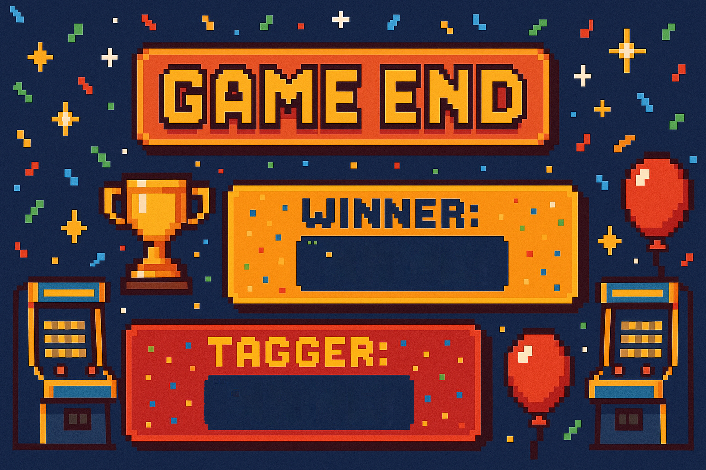

# 🏃 Catch & Run! — 2D Local Multiplayer Action

[](https://unity.com/)
[](https://docs.microsoft.com/en-us/dotnet/csharp/)
[](https://unity.com/)
[](https://www.microsoft.com/windows)
[](LICENSE)

**Catch & Run!** is a fast-paced, local network (LAN) 2D multiplayer tag game developed with Unity and C#. Players compete across interactive arena maps where taggers chase runners, utilizing real-time throwable object physics, stun mechanics, obstacle navigation, and synchronized timers to secure victory.

---

## 📸 Media & In-Game Showcase

### 🎮 Gameplay & Interactive Mechanics
<p align="center">
  
  
</p>
<p align="center">
  
</p>

### 🌐 Menu, Matchmaking & Lobby Flow
<p align="center">
  
  
  
</p>

<p align="center">
  
</p>

---

## 🌟 Key Technical Features

### 1. 🔄 Host-Client LAN Networking & State Synchronization
* **Network Transform & Rigidbody Sync:** Low-latency player position, velocity, and rotation interpolation across local network sockets.
* **Role State Authority:** Authoritative server-side validation for tagging logic to eliminate latency-induced phantom hits.
* **Networked Game Loop:** Synchronized match countdowns, round timers, dynamic role assignment, and win/loss resolution.

### 2. 🎯 Physics-Driven Throw & Stun Mechanics
* **Interactive Pickups:** Runners and taggers can pick up arena objects (e.g., flowerpots) with contextual input triggers (`E`).
* **Stun System:** Successful projectile impacts apply an extensible status effect (`IStunnable`), interrupting movement input and physics forces for a balanced recovery window.

### 3. 🏃 Agile 2D Movement Architecture
* **Responsive Kinematics:** Custom raycast-assisted obstacle detection combined with Rigidbody2D velocity damping for tight controls.
* **Input Decoupling:** Player input is separated from character controllers via clean C# event delegates, enabling seamless replay or AI extensions.

---

## 🏛️ Code Architecture & Design Patterns

The codebase follows **SOLID** design principles, utilizing **State Patterns**, **Managers/Singletons for Core Game Loops**, and the **Observer Pattern (C# Events)** for decoupled UI and audio integration.

### Core Systems Breakdown

```text
Assets/
├── Scripts/
│   ├── Core/
│   │   ├── GameManager.cs          # Master match state machine & win conditions
│   │   ├── RoundManager.cs          # Round timer, score tracking & player spawns
│   │   └── NetworkManagerCustom.cs # LAN socket bindings & connection handling
│   ├── Player/
│   │   ├── PlayerController.cs     # 2D physics movement, dashing & inputs
│   │   ├── PlayerRole.cs           # Tagger vs Runner state logic
│   │   ├── ThrowSystem.cs          # Projectile aiming, trajectory & release
│   │   └── StunHandler.cs          # Status effect timer, input locks & VFX trigger
│   ├── Interactables/
│   │   ├── ProjectileItem.cs       # Collision resolution & knockback forces
│   │   └── IStunnable.cs           # Interface for crowd control mechanics
│   └── UI/
│       ├── MainMenuUI.cs           # Host/Join lobby setup
│       ├── GameHUD.cs              # Real-time timers, role indicator & mini-map
│       └── EndGameUI.cs            # Match summary, scoreboard & rematch trigger
